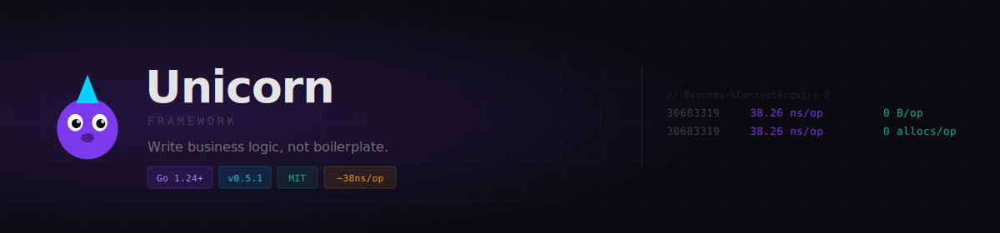

<picture>
  <source media="(prefers-color-scheme: dark)"  srcset="./assets/readme-header-dark.svg">
  <source media="(prefers-color-scheme: light)" srcset="./assets/readme-header-light.svg">
  
</picture>

A batteries-included Go framework where developers only need to focus on business logic.

[](https://go.dev)
[](LICENSE)

## Features

### Core Framework
- **Focus on Business Logic** - Write handlers that only contain business logic
- **Multi-Trigger Support** - Same handler works for HTTP, Kafka, RabbitMQ, gRPC, Cron
- **Generic Adapter Pattern** - Swap infrastructure (DB, Cache, Logger, etc.) without code changes
- **Multiple Named Adapters** - Support multiple databases, caches, brokers per app
- **Custom Service Injection** - Inject your own interfaces with type-safe generics
- **Production-Ready Middleware** - Request/Response logging, compression (Gzip/Brotli), CSRF
- **Resilience Patterns** - Circuit Breaker, Retry with exponential backoff
- **Database Tools** - Migrations, transactions with savepoints, rollback support
- **Observability** - Metrics, tracing, structured logging, health checks
- **Multi-Service Mode** - Run multiple services independently or together
- **Sidecar Pattern** - Auxiliary processes + triggers as sidecars for hybrid deployment
- **High Performance** - Zero-allocation context pooling (~38ns/op)

### 🚀 Enterprise Features
- **OAuth2/OIDC Authentication** - Google, GitHub, Microsoft, Generic OIDC providers
- **RBAC Authorization** - Role-based access control with wildcards and inheritance
- **Multi-Tenancy** - Subdomain, header, path, and custom tenant isolation
- **Configuration Management** - Viper-based config with hot reload and multiple sources
- **Pagination** - Offset-based and cursor-based pagination with HATEOAS links
- **API Versioning** - URL, header, query, and custom versioning strategies
- **Semantic Versioning** - Version comparison and deprecation support

## Project Structure

```
github.com/madcok-co/unicorn/
├── core/                       # Core framework
│   ├── pkg/
│   │   ├── app/                # Application lifecycle
│   │   ├── context/            # Request context (optimized)
│   │   ├── contracts/          # Interface definitions
│   │   ├── handler/            # Handler registry
│   │   ├── middleware/         # Production middleware
│   │   ├── resilience/         # Resilience patterns
│   │   ├── sidecar/            # Trigger sidecars
│   │   ├── migration/          # Database migrations
│   │   ├── transaction/        # Transaction support
│   │   ├── service/            # Service registry
│   │   ├── openapi/            # OpenAPI support
│   │   └── adapters/           # Built-in adapters
│   ├── cmd/unicorn/            # CLI tool
│   └── examples/               # Example applications
│
├── contrib/                    # Official drivers & enterprise features
│   ├── auth/oauth2/            # 🚀 OAuth2/OIDC authentication
│   ├── authz/rbac/             # 🚀 RBAC authorization
│   ├── config/                 # 🚀 Configuration management
│   ├── multitenancy/           # 🚀 Multi-tenant support
│   ├── pagination/             # 🚀 Pagination helpers
│   ├── versioning/             # 🚀 API versioning
│   ├── database/gorm/          # GORM database driver
│   ├── cache/redis/            # Redis cache driver
│   ├── logger/zap/             # Zap logger driver
│   ├── broker/kafka/           # Kafka message broker driver
│   ├── broker/mqtt/            # MQTT broker driver
│   ├── grpc/                   # gRPC adapter
│   ├── websocket/              # WebSocket driver
│   ├── sidecar/management/     # Management server
│   ├── sidecar/configwatcher/  # Config watcher
│   ├── sidecar/discovery/      # Service discovery
│   ├── sidecar/secretrotator/  # Secret rotation
│   └── validator/playground/   # go-playground/validator driver
│
└── docs/                       # Documentation
```

## 🤖 For AI Assistants

If you're using Claude, ChatGPT, or Copilot to generate Unicorn code, see [CLAUDE.md](./CLAUDE.md) for the complete AI assistant reference — handler patterns, import paths, middleware, and a code generation checklist.

## Quick Start

### Installation

**Latest stable release (recommended):**
```bash
go get github.com/madcok-co/unicorn/core@latest
```

**Specific version:**
```bash
go get github.com/madcok-co/unicorn/core@v0.1.0
```

**Latest development (bleeding edge):**
```bash
go get github.com/madcok-co/unicorn/core@main
```

**Install enterprise features:**
```bash
# Install enterprise features you need
go get github.com/madcok-co/unicorn/contrib/auth/oauth2@latest        # OAuth2/OIDC
go get github.com/madcok-co/unicorn/contrib/authz/rbac@latest         # RBAC
go get github.com/madcok-co/unicorn/contrib/multitenancy@latest       # Multi-tenancy
go get github.com/madcok-co/unicorn/contrib/config@latest             # Configuration
go get github.com/madcok-co/unicorn/contrib/pagination@latest         # Pagination
go get github.com/madcok-co/unicorn/contrib/versioning@latest         # API Versioning
```

**Install core drivers:**
```bash
# Install drivers you need
go get github.com/madcok-co/unicorn/contrib/database/gorm@latest
go get github.com/madcok-co/unicorn/contrib/cache/redis@latest
go get github.com/madcok-co/unicorn/contrib/logger/zap@latest
go get github.com/madcok-co/unicorn/contrib/broker/kafka@latest
go get github.com/madcok-co/unicorn/contrib/validator/playground@latest
```

### Basic Example

```go
package main

import (
    "log"
    
    httpAdapter "github.com/madcok-co/unicorn/core/pkg/adapters/http"
    "github.com/madcok-co/unicorn/core/pkg/app"
    "github.com/madcok-co/unicorn/core/pkg/context"
)

type CreateUserRequest struct {
    Name  string `json:"name" validate:"required"`
    Email string `json:"email" validate:"required,email"`
}

type User struct {
    ID    string `json:"id"`
    Name  string `json:"name"`
    Email string `json:"email"`
}

func main() {
    // Create application
    application := app.New(&app.Config{
        Name:       "my-app",
        Version:    "1.0.0",
        EnableHTTP: true,
        HTTP: &httpAdapter.Config{
            Host: "0.0.0.0",
            Port: 8080,
        },
    })

    // Register handler
    application.RegisterHandler(CreateUser).
        Named("create-user").
        HTTP("POST", "/users").
        Done()

    // Start application
    if err := application.Start(); err != nil {
        log.Fatal(err)
    }
}

// Handler - pure business logic!
func CreateUser(ctx *context.Context, req CreateUserRequest) (*User, error) {
    // Access infrastructure via context (when configured)
    // db := ctx.DB()      // Database
    // cache := ctx.Cache() // Cache
    // log := ctx.Logger()  // Logger
    
    user := &User{
        ID:    "user-123",
        Name:  req.Name,
        Email: req.Email,
    }
    
    // Database example:
    // if err := db.Create(user); err != nil {
    //     return nil, err
    // }
    
    return user, nil
}
```

## Core Concepts

### Multi-Trigger Handlers

Same handler responds to multiple triggers:

```go
app.RegisterHandler(ProcessOrder).
    HTTP("POST", "/orders").           // REST API
    Message("order.create.command").   // Message broker
    Cron("*/5 * * * *").               // Every 5 minutes
    Done()
```

### Generic Adapter Pattern

Swap infrastructure without changing business logic:

```go
// Development - use in-memory
app.SetCache(memory.NewDriver())

// Production - use Redis
app.SetCache(redis.NewDriver(redisClient))

// Handler code stays the same!
func handler(ctx *context.Context) error {
    ctx.Cache().Set(ctx.Context(), "key", "value", time.Hour)
    return nil
}
```

### Multiple Named Adapters

Support multiple instances for scaling:

```go
// Multiple databases
app.SetDB(gorm.NewDriver(primaryDB))                    // Default
app.SetDB(gorm.NewDriver(analyticsDB), "analytics")     // Named
app.SetDB(gorm.NewDriver(replicaDB), "replica")         // Named

// In handler
func handler(ctx *context.Context) error {
    ctx.DB().Create(ctx.Context(), &user)                    // Primary
    ctx.DB("analytics").Create(ctx.Context(), &event)        // Analytics
    ctx.DB("replica").FindAll(ctx.Context(), &users, "")     // Replica
    return nil
}
```

### Multi-Service Mode

Organize handlers into services:

```go
// User Service
app.Service("user-service").
    Register(CreateUser).HTTP("POST", "/users").Done().
    Register(GetUser).HTTP("GET", "/users/:id").Done()

// Order Service
app.Service("order-service").
    DependsOn("user-service").
    Register(CreateOrder).HTTP("POST", "/orders").Done()

// Run all or specific services
app.Start()                              // All services
app.RunServices("user-service")          // Specific service
```

## Enterprise Features Usage

### OAuth2/OIDC Authentication

Authenticate users with multiple OAuth2 providers:

```go
import (
    "github.com/madcok-co/unicorn/contrib/auth/oauth2"
    "github.com/madcok-co/unicorn/core/pkg/contracts"
)

// Setup OAuth2 (Google example)
auth := oauth2.NewDriver(&oauth2.Config{
    Provider:     oauth2.ProviderGoogle,
    ClientID:     "your-client-id",
    ClientSecret: "your-client-secret",
    RedirectURL:  "http://localhost:8080/auth/callback",
    Scopes:       []string{"openid", "email", "profile"},
})

app.SetAuth(auth)

// Login handler
func Login(ctx *context.Context, req oauth2.AuthRequest) (*oauth2.AuthResponse, error) {
    identity, err := ctx.Auth().Authenticate(ctx.Context(), map[string]interface{}{
        "code":  req.Code,
        "state": req.State,
    })
    if err != nil {
        return nil, err
    }
    
    return &oauth2.AuthResponse{
        Token: identity.Token,
        User:  identity.Claims,
    }, nil
}
```

### RBAC Authorization

Role-based access control with wildcards:

```go
import "github.com/madcok-co/unicorn/contrib/authz/rbac"

// Setup RBAC
authz := rbac.NewDriver()
app.SetAuthz(authz)

// Define roles and permissions
authz.CreateRole("admin", []string{"*"})
authz.CreateRole("editor", []string{"posts:*", "comments:read"})
authz.CreateRole("viewer", []string{"*:read"})

// Assign role to user
authz.AssignRole("user-123", "editor")

// Check permissions in handler
func DeletePost(ctx *context.Context, req DeletePostRequest) error {
    identity := &contracts.Identity{ID: "user-123"}
    
    allowed, err := ctx.Authz().Authorize(ctx.Context(), identity, "delete", "posts")
    if err != nil || !allowed {
        return errors.New("forbidden")
    }
    
    // Delete post logic
    return nil
}
```

### Multi-Tenancy

Isolate data by tenant with flexible strategies:

```go
import "github.com/madcok-co/unicorn/contrib/multitenancy"

// Setup multi-tenancy (subdomain strategy)
mt := multitenancy.NewDriver(&multitenancy.Config{
    Strategy: multitenancy.StrategySubdomain,
    Domain:   "myapp.com",
})

// Create tenants
mt.CreateTenant(&multitenancy.Tenant{
    ID:     "acme",
    Name:   "Acme Corp",
    Active: true,
})

// Resolve tenant in handler
func GetData(ctx *context.Context, req GetDataRequest) (*DataResponse, error) {
    tenant, err := mt.GetTenantFromRequest(ctx.Context(), ctx.Request())
    if err != nil {
        return nil, err
    }
    
    // Query data filtered by tenant
    var data []Item
    ctx.DB().Where("tenant_id = ?", tenant.ID).FindAll(ctx.Context(), &data, "")
    
    return &DataResponse{Items: data}, nil
}
```

### Configuration Management

Dynamic configuration with hot reload:

```go
import "github.com/madcok-co/unicorn/contrib/config"

// Setup config
cfg := config.NewDriver(&config.Config{
    Defaults: map[string]interface{}{
        "app.name": "MyApp",
        "app.port": 8080,
    },
    Files:      []string{"config.yaml", "config.json"},
    EnvPrefix:  "MYAPP",
    AutoReload: true,
})

// Watch for changes
cfg.OnChange(func(key string, value interface{}) {
    log.Printf("Config changed: %s = %v", key, value)
})

// Use in handler
func GetSettings(ctx *context.Context) (*SettingsResponse, error) {
    return &SettingsResponse{
        AppName:    cfg.GetString("app.name"),
        MaxUpload:  cfg.GetInt64("upload.max_size"),
        Features:   cfg.GetStringSlice("features.enabled"),
    }, nil
}
```

### Pagination

Offset and cursor-based pagination with HATEOAS:

```go
import "github.com/madcok-co/unicorn/contrib/pagination"

// Offset-based pagination (small datasets)
func ListUsers(ctx *context.Context, req ListUsersRequest) (*pagination.OffsetResult, error) {
    params := pagination.ParseOffsetParams(req.Page, req.Limit, req.Sort, req.Order)
    
    var users []User
    var total int64
    
    query := pagination.BuildOffsetQuery("users", params)
    ctx.DB().Raw(ctx.Context(), query, &users)
    ctx.DB().Raw(ctx.Context(), "SELECT COUNT(*) FROM users", &total)
    
    return pagination.NewOffsetResult(users, total, params), nil
}

// Cursor-based pagination (large datasets)
func ListOrders(ctx *context.Context, req ListOrdersRequest) (*pagination.CursorResult, error) {
    params := pagination.ParseCursorParams(req.Cursor, req.Limit, req.Sort, req.Order)
    
    var orders []Order
    query := pagination.BuildCursorQuery("orders", params)
    ctx.DB().Raw(ctx.Context(), query, &orders)
    
    return pagination.NewCursorResult(orders, params), nil
}
```

### API Versioning

Multiple versioning strategies with deprecation support:

```go
import "github.com/madcok-co/unicorn/contrib/versioning"

// Setup versioning (URL-based)
vm := versioning.NewManager(&versioning.Config{
    Strategy: versioning.StrategyURL,
    Prefix:   "/api",
})

// Add version deprecation
vm.AddDeprecation("1.0", time.Now().Add(90*24*time.Hour), "2.0")

// Version middleware (applied as HTTP-level middleware)
app.Use(func(next http.Handler) http.Handler {
    return http.HandlerFunc(func(w http.ResponseWriter, r *http.Request) {
        version, err := vm.ResolveVersion(r)
        if err != nil {
            http.Error(w, "Invalid version", http.StatusBadRequest)
            return
        }
        
        // Set deprecation headers if needed
        vm.SetDeprecationHeaders(w, version)
        
        next.ServeHTTP(w, r)
    })
})

// Version-specific handlers
app.RegisterHandler(GetUserV1).HTTP("GET", "/api/v1/users/:id").Done()
app.RegisterHandler(GetUserV2).HTTP("GET", "/api/v2/users/:id").Done()
```

## Available Drivers

| Category | Driver | Package |
|----------|--------|---------|
| Database | GORM | `contrib/database/gorm` |
| Cache | Redis | `contrib/cache/redis` |
| Logger | Zap | `contrib/logger/zap` |
| Broker | Kafka | `contrib/broker/kafka` |
| Broker | MQTT | `contrib/broker/mqtt` |
| RPC | gRPC | `contrib/grpc` |
| Real-time | WebSocket | `contrib/websocket` |
| Validator | Playground | `contrib/validator/playground` |

See [contrib/README.md](./contrib/README.md) for full driver documentation.

## Production-Ready Features

### Middleware

| Feature | Package | Description |
|---------|---------|-------------|
| Recovery | `middleware` | Panic recovery with stack traces |
| Timeout | `middleware` | Request timeout control |
| CORS | `middleware` | Cross-origin resource sharing |
| Compression | `middleware` | Gzip + Brotli response compression |
| Logging | `middleware` | Structured request/response logging |
| CSRF | `middleware` | Cross-site request forgery protection |
| File Upload | `middleware` | Upload with size/type validation |
| Rate Limiting | `middleware` | Configurable rate limiting |
| JWT Auth | `middleware` | JSON Web Token authentication |
| API Key Auth | `middleware` | API key authentication |
| Basic Auth | `middleware` | HTTP Basic authentication |
| Tracing | `middleware` | Distributed tracing support |
| Metrics | `middleware` | Request metrics collection |
| Health Check | `middleware` | Health check endpoint |
| Circuit Breaker | `resilience` | Fault tolerance pattern |
| Retry | `resilience` | Exponential backoff retry |

### Sidecars

- **ManagementServer** — Kubernetes probes, Prometheus metrics, pprof
- **ConfigWatcher** — Hot-reload config without restart
- **ServiceRegistrar** — Auto register/deregister with Consul
- **SecretRotator** — Rotate credentials from Vault/K8s secrets
- **Trigger Sidecars** — Run HTTP, Broker, Cron as isolated sidecars

## Performance

Unicorn is optimized for high performance:

- **Zero-allocation** context pooling
- **Lazy adapter injection** - no copying per request
- **~38ns** per context acquire/release

```
BenchmarkContextAcquire-8    30683319    38.26 ns/op    0 B/op    0 allocs/op
```

See [docs/PERFORMANCE.md](./docs/PERFORMANCE.md) for deep-dive optimization and [docs/benchmarks.md](./docs/benchmarks.md) for raw benchmark numbers.

## Documentation

- [Getting Started](./docs/getting-started.md) - Installation and first app
- [Architecture](./docs/architecture.md) - Framework design
- [Handlers & Triggers](./docs/handlers.md) - Handler patterns
- [Middleware](./docs/middleware.md) - Production middleware
- [Custom Services](./docs/custom-services.md) - Dependency injection
- [Security](./docs/security.md) - Authentication, authorization
- [Observability](./docs/observability.md) - Metrics, tracing, logging
- [Resilience](./docs/resilience.md) - Circuit breaker, retry
- [Sidecar Pattern](./docs/sidecar.md) - Cross-cutting sidecars
- [Performance](./docs/PERFORMANCE.md) - Optimization guide + FAQ
- [Benchmarks](./docs/benchmarks.md) - Performance numbers
- [Comparison](./docs/comparison.md) - vs Gin, Echo, Fiber
- [Migration Guide](./docs/migration-guide.md) - Migrate to Unicorn
- [API Reference](./docs/api-reference.md) - Complete API
- [Best Practices](./docs/best-practices.md) - Production checklist
- [Examples](./docs/examples.md) - Complete example apps

## Examples

```bash
# Basic example
cd core/examples/basic
go run main.go

# Multi-service example
cd core/examples/multiservice
go run main.go
```

## License

MIT License

## Contributing

Contributions are welcome! Please read our contributing guidelines before submitting PRs.

---

## Creator's Note

This framework was built based on real-world production experience, combining battle-tested patterns from various ecosystems (Spring Boot, NestJS, Laravel) adapted for Go's philosophy.

**Before you criticize:**

1. **"Why not just use Gin/Echo/Fiber?"** - Those are routers, not frameworks. Unicorn is a full application framework with built-in support for multi-trigger handlers, infrastructure abstraction, resilience patterns, and production middleware. Different tools for different problems.

2. **"This is over-engineered!"** - If you're building a simple CRUD API, yes, use something simpler. Unicorn is designed for complex, multi-service production systems where you need consistent patterns across teams.

3. **"Go should be simple!"** - The handlers ARE simple. The complexity is in the framework so YOUR code stays clean. That's the whole point.

4. **"I can build this myself!"** - Great, do it. But when you've spent 6 months reinventing circuit breakers, health checks, graceful shutdown, and adapter patterns, remember this exists.

5. **"Where are the benchmarks against X?"** - See [docs/benchmarks.md](./docs/benchmarks.md). Spoiler: it's fast enough. If nanoseconds matter more than developer productivity, you're optimizing the wrong thing.

6. **"This doesn't follow DDD/Clean Architecture/Hexagonal!"** - Cool. Those are guidelines, not gospel. If your 500-line CRUD service needs 47 layers of abstraction, bounded contexts, aggregate roots, and a domain expert consultation, you have different problems. Unicorn gives you clean separation where it matters (infrastructure vs business logic) without forcing you into architecture astronaut territory. Use DDD when you actually need it, not because someone on Medium said so.

7. **"You should use Repository Pattern!"** - The adapter pattern IS a repository pattern, just not named that way to satisfy your design pattern bingo card. `ctx.DB()` abstracts your data layer. Done. No need for `UserRepositoryInterface`, `UserRepositoryImpl`, `UserRepositoryFactory`, and 15 other files for a single table.

8. **"Where's the Service Layer?"** - Your handler IS your service. If you need more abstraction, create your own services and inject them via `app.Set()`. We're not forcing 3-tier architecture on a 200-line microservice.

9. **"This violates SOLID principles!"** - Which one? Single Responsibility? Handlers do one thing. Open/Closed? Use middleware. Liskov? Adapters are swappable. Interface Segregation? Check `contracts/`. Dependency Inversion? The whole framework is built on it. Next.

10. **"Real engineers use stdlib only!"** - Real engineers ship products. If you want to write your own HTTP router, connection pooling, circuit breaker, and graceful shutdown from scratch every project, go ahead. Some of us have deadlines.

11. **"Microservices should be micro!"** - This framework supports both monolith and microservices. The multi-service mode lets you split when you NEED to, not because some conference talk said so. Premature distribution is the root of all evil.

12. **"You're not using Context correctly!"** - We extend `context.Context` for developer ergonomics while maintaining full compatibility. If passing 47 parameters to every function or using context.Value for everything is your preference, enjoy your type assertions.

13. **"Global state is bad!"** - There's no global state. The app instance holds everything. You can create multiple apps if you want. The `ctx.DB()` pattern is dependency injection, not global access.

14. **"What about testing?"** - Mock the adapters. That's literally why the adapter pattern exists. `app.SetDB(mockDB)` and you're done. No complex DI container or test framework required.

15. **"This isn't idiomatic Go!"** - "Idiomatic Go" is not a religion. If your idiomatic code requires 3x more boilerplate for the same result, maybe the idiom needs updating. Go itself has evolved (generics, anyone?).

**The philosophy is simple:** Write business logic, not infrastructure code. Ship products, not architecture diagrams. If you disagree, that's fine - mass unfollow, mass block. Use what works for you.

**To the haters:** The mass unfollow and mass block is real, fuck off and mass block my ass. I don't mass care.

---

*Built with frustation from years of writing the same boilerplate across different projects.*
